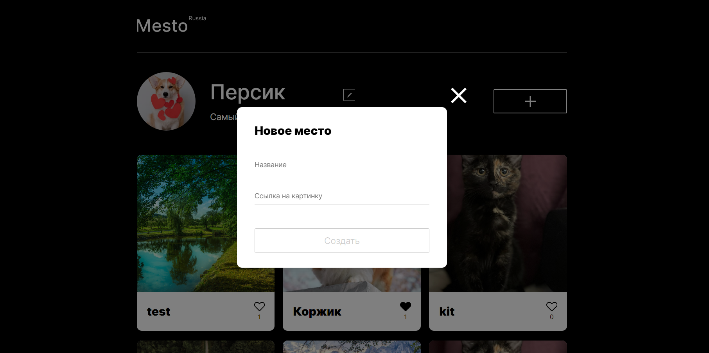
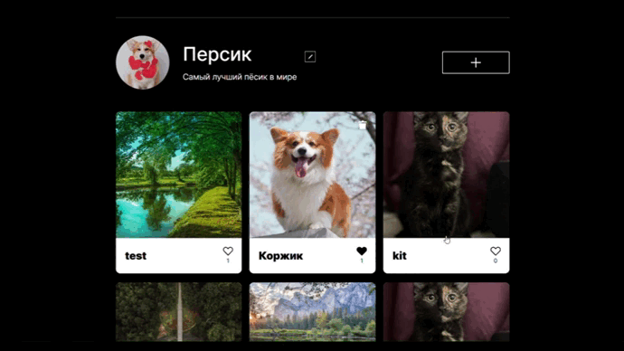
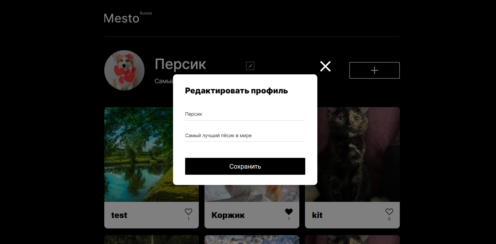
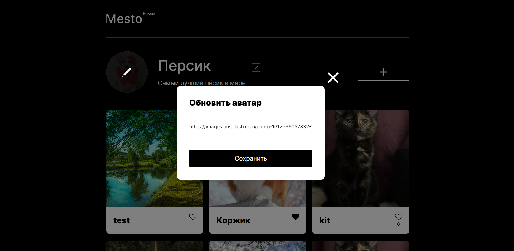
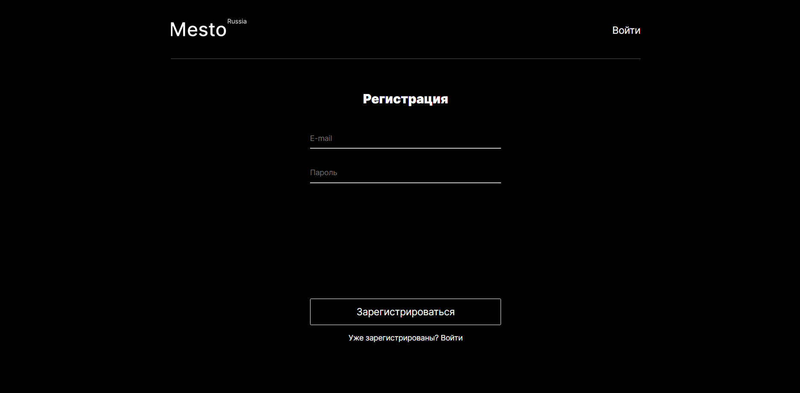
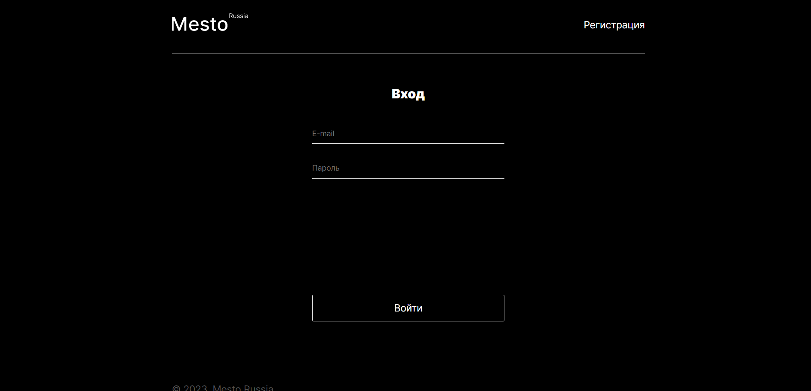
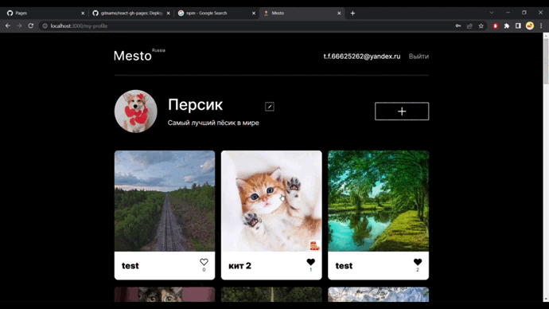

# Проект: Место

## Обзор

* Figma
* Сайт проекта
* Описание проекта
* Что использовалось?
* Как запустить?
* Доработка

## **Figma**

[Ссылка на макет в Figma](https://www.figma.com/file/2cn9N9jSkmxD84oJik7xL7/JavaScript.-Sprint-4?node-id=0%3A1)

## **Сайт проекта**

[Ссылка на сайт](https://frantsuzovatamara.github.io/react-mesto-auth/)

## **Описание проекта**

Это интерактивная страница, на которой можно:

* делиться своими фотографиями и видеть фотографии других пользователей

* удалять свои карточки (у личных карточек есть иконка урны, у карточек других пользователей такой иконки нет), ставить лайки своим карточкам и карточкам других пользователей

* редактировать свой профиль

* менять аватар профиля

* регистрироваться, авторизовываться (при повторном входе авторизация не нужна) и выходить из профиля

## **Что использовалось?**

* HTML
* CSS
* Методология БЭМ
* JavaScript
* Create React App
* Хуки и классовые элементы
* JSX
* NPM
* Api

## **Как запустить?**

Для запуска проекта необходимо ввести в терминале команду **npm start** в ветке main.

## **Доработка**

Для улучшения интерфейса можно также: 

* добавить возможность менять дизайн страницы
* добавлять помимо названий также автора той или иной карточки
* добавить возможность оставлять комментарии к карточкам